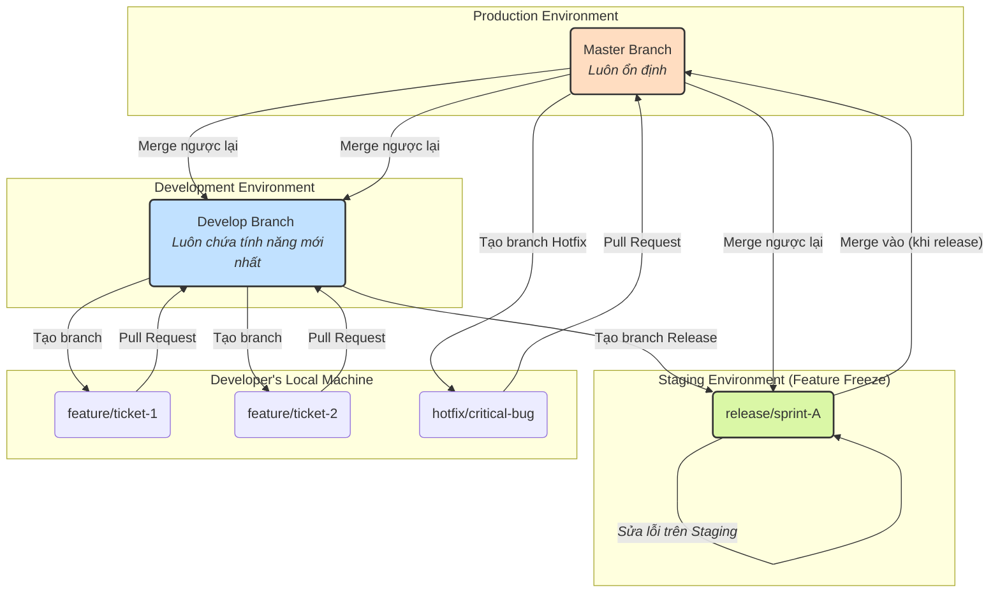

Chắc chắn rồi. Việc xây dựng một tài liệu trực quan, dễ hiểu là chìa khóa để cả team làm việc đồng bộ và hiệu quả.

Vì không thể tạo một website thực tế, tôi sẽ cấu trúc câu trả lời này dưới dạng một trang tài liệu duy nhất (single-page website) với các mục lục rõ ràng. Bạn có thể sao chép nội dung này vào các công cụ như Confluence, Notion, hoặc Wiki nội bộ của công ty để dễ dàng chia sẻ và cập nhật.

Điểm nhấn của tài liệu này là **sơ đồ luồng công việc (workflow diagram)** để mọi người có thể hình dung toàn bộ bức tranh một cách nhanh chóng.

---

## **TÀI LIỆU HƯỚNG DẪN QUY TRÌNH LÀM VIỆC VỚI GIT & GITHUB**

### **Mục Lục**

1.  [**Tổng Quan & Triết Lý**](#1-tổng-quan--triết-lý)
2.  [**Sơ Đồ Luồng Công Việc Trực Quan**](#2-sơ-đồ-luồng-công-việc-trực-quan)
3.  [**Các Loại Branch và Vai Trò**](#3-các-loại-branch-và-vai-trò)
4.  [**Luồng Công Việc 1: Phát Triển Một Tính Năng Mới (Quy trình chuẩn)**](#4-luồng-công-việc-1-phát-triển-một-tính-năng-mới-quy-trình-chuẩn)
5.  [**Luồng Công Việc 2: Chuẩn Bị và Release một Sprint**](#5-luồng-công-việc-2-chuẩn-bị-và-release-một-sprint)
6.  [**Luồng Công Việc 3: Sửa Lỗi Khẩn Cấp trên Production (Hotfix)**](#6-luồng-công-việc-3-sửa-lỗi-khẩn-cấp-trên-production-hotfix)
7.  [**Tình Huống Đặc Biệt: Release Gấp Khi Đang Verify Staging**](#7-tình-huống-đặc-biệt-release-gấp-khi-đang-verify-staging)
8.  [**Quy Tắc Vàng & Nguyên Tắc Đặt Tên**](#8-quy-tắc-vàng--nguyên-tắc-đặt-tên)

---

### **1. Tổng Quan & Triết Lý**

Tài liệu này mô tả quy trình làm việc chuẩn với Git, dựa trên mô hình **Git Flow được tinh chỉnh** để phù hợp với 3 môi trường (Develop, Staging, Production) của chúng ta.

*   **Mục tiêu:** Đảm bảo `master` luôn ổn định, `develop` luôn chứa những gì mới nhất, và quy trình release được kiểm soát chặt chẽ.
*   **Triết lý:** Mọi thay đổi đều phải thông qua Pull Request (PR) để review. Không ai được push code trực tiếp lên `develop` và `master`.

---

### **2. Sơ Đồ Luồng Công Việc Trực Quan**

Đây là toàn bộ bức tranh về cách các branch tương tác với nhau.



---

### **3. Các Loại Branch và Vai Trò**

| Tên Branch | Vai Trò & Quy Tắc | Vòng Đời |
| :--- | :--- | :--- |
| **`master`** | **Branch chính.** Chỉ chứa code đã được release lên Production. `master` phải luôn ở trạng thái sẵn sàng để deploy. **CẤM** push trực tiếp. | Vĩnh viễn |
| **`develop`** | **Branch chính.** Branch tích hợp chính cho tất cả các tính năng. Khi một tính năng hoàn thành, nó sẽ được merge vào đây. **CẤM** push trực tiếp. | Vĩnh viễn |
| **`feature/*`** | **Branch phụ.** Dùng để phát triển một tính năng mới hoặc một task cụ thể. Luôn được tạo từ `develop`. Ví dụ: `feature/TICKET-123-update-user-profile`. | Tạm thời |
| **`release/*`** | **Branch phụ.** Dùng để "đóng băng" code, chuẩn bị cho một phiên bản release. Được tạo từ `develop`. Mọi hoạt động sửa lỗi cho release sẽ diễn ra trên branch này. | Tạm thời |
| **`hotfix/*`** | **Branch phụ.** Dùng để sửa các lỗi khẩn cấp trên Production. Luôn được tạo từ `master`. | Tạm thời |

---

### **4. Luồng Công Việc 1: Phát Triển Một Tính Năng Mới (Quy trình chuẩn)**

Đây là luồng công việc hàng ngày của mỗi Developer.

**Mục tiêu:** Đưa code của một ticket từ máy local lên môi trường Develop.

1.  **Bước 1: Đồng bộ hóa với `develop`**
    Đảm bảo bạn bắt đầu từ code mới nhất.
    ```bash
    git checkout develop
    git pull origin develop
    ```

2.  **Bước 2: Tạo branch `feature` mới**
    Đặt tên theo quy tắc đã thống nhất.
    ```bash
    git checkout -b feature/TICKET-123-ten-ngan-gon
    ```

3.  **Bước 3: Coding và Commit**
    Thực hiện công việc của bạn và commit thường xuyên với message rõ ràng.
    ```bash
    # ... làm việc ...
    git add .
    git commit -m "feat(TICKET-123): Thêm chức năng xác thực người dùng"
    ```

4.  **Bước 4: Đẩy branch lên GitHub**
    ```bash
    git push -u origin feature/TICKET-123-ten-ngan-gon
    ```

5.  **Bước 5: Tạo Pull Request (PR)**
    *   Mở GitHub, bạn sẽ thấy một thông báo để tạo PR.
    *   **Target branch:** `develop`.
    *   **Source branch:** `feature/TICKET-123...`
    *   Viết mô tả PR rõ ràng: link ticket, những gì đã thay đổi, cách để Tester kiểm tra.
    *   Gán Reviewer.

6.  **Bước 6: Review và Merge**
    *   Reviewer sẽ xem code và để lại comment nếu cần.
    *   Sau khi PR được **approve**, Tech Lead/PM sẽ merge PR vào `develop`.
    *   **Hoàn tất!** Code của bạn giờ đã có trên môi trường Develop.

---

### **5. Luồng Công Việc 2: Chuẩn Bị và Release một Sprint**

Luồng công việc này thường do Tech Lead thực hiện.

**Mục tiêu:** Chốt các tính năng, ổn định hệ thống trên Staging và release lên Production.

1.  **Bước 1: "Đóng băng" tính năng (Feature Freeze)**
    Vào ngày đã định (ví dụ: đầu tuần cuối của sprint), tạo branch `release/*` từ `develop`.
    ```bash
    git checkout develop
    git pull origin develop

    # Tạo branch release theo tên sprint hoặc ngày release
    git checkout -b release/sprint-19092025
    git push origin release/sprint-19092025
    ```
    *CI/CD sẽ tự động deploy branch này lên môi trường **Staging**.*

2.  **Bước 2: Giai đoạn ổn định trên Staging**
    *   Tester thực hiện kiểm thử toàn diện trên Staging.
    *   **Nếu có lỗi:** Developer sẽ tạo branch sửa lỗi từ `release/sprint-19092025`, sửa và tạo PR merge ngược lại vào chính branch `release/sprint-19092025`.
    *   **Quan trọng:** Các commit sửa lỗi này phải được **cherry-pick** vào `develop` để tránh lặp lại lỗi.

3.  **Bước 3: Thực hiện Release**
    Khi Staging đã hoàn toàn ổn định, Tech Lead thực hiện các lệnh cuối cùng.
    ```bash
    # 1. Merge vào master
    git checkout master
    git pull origin master
    git merge --no-ff release/sprint-19092025
    git push origin master

    # 2. Tạo Tag cho phiên bản
    git tag -a v1.5.0 -m "Release version 1.5.0"
    git push origin v1.5.0

    # 3. Merge master ngược lại vào develop để đồng bộ
    git checkout develop
    git merge --no-ff master
    git push origin develop
    ```

4.  **Bước 4: Dọn dẹp**
    Xóa branch `release/sprint-19092025` trên GitHub.

---

### **6. Luồng Công Việc 3: Sửa Lỗi Khẩn Cấp trên Production (Hotfix)**

Khi có một lỗi nghiêm trọng cần vá ngay lập tức.

1.  **Bước 1: Tạo branch `hotfix` từ `master`**
    Đây là điểm khác biệt quan trọng nhất.
    ```bash
    git checkout master
    git pull origin master
    git checkout -b hotfix/TICKET-456-sua-loi-login
    ```

2.  **Bước 2: Sửa lỗi và tạo PR**
    Sau khi sửa xong, tạo PR merge vào branch `master`.

3.  **Bước 3: Release Hotfix**
    Sau khi PR được approve và merge, thực hiện các bước giống như release sprint: **Tạo Tag mới** trên `master` (ví dụ: `v1.5.1`) và deploy.

4.  **Bước 4: Đồng bộ hóa**
    Đây là bước **bắt buộc** để tránh mất code hotfix.
    ```bash
    # Merge master (đã chứa hotfix) vào develop
    git checkout develop
    git merge --no-ff master
    git push origin develop

    # Nếu có branch release/* đang chạy, cũng phải merge vào đó
    git checkout release/sprint-19092025
    git merge --no-ff master
    git push origin release/sprint-19092025
    ```

5.  **Bước 5: Dọn dẹp**
    Xóa branch `hotfix/*`.

---

### **7. Tình Huống Đặc Biệt: Release Gấp Khi Đang Verify Staging**

**Kịch bản:** Team đang test trên `release/sprint-A` thì sếp yêu cầu release gấp một tính năng B.

**Giải pháp:** "Tạm dừng" sprint, ưu tiên việc gấp, sau đó quay lại.

1.  **Giao tiếp:** Thông báo toàn team tạm dừng verify Staging.
2.  **Tạo branch Hotfix/Feature khẩn cấp:** Vẫn tuân thủ quy tắc, tạo branch mới từ `master`.
    ```bash
    git checkout master
    git pull
    git checkout -b hotfix/feature-B-khan-cap
    ```
3.  **Phát triển & Test:** Code tính năng B. Để test trên Staging:
    *   **Cách an toàn:** Dùng tính năng "Deploy thủ công" của CI/CD để chỉ định deploy branch `hotfix/feature-B-khan-cap` lên Staging.
    *   **Cách khác (nếu CI/CD không hỗ trợ):** Tạo branch tạm `staging/temp-test-B` từ `master`, cherry-pick code của feature B vào, rồi deploy branch tạm này.
4.  **Release việc gấp:** Sau khi test xong, merge branch `hotfix/feature-B-khan-cap` vào `master`, tag và deploy.
5.  **Đồng bộ hóa:** **Merge `master` (đã chứa feature B) vào `develop` VÀ `release/sprint-A`**.
6.  **Khôi phục Staging:** Deploy lại branch `release/sprint-A` (giờ đã có cả feature B) lên Staging.
7.  **Giao tiếp:** Thông báo team tiếp tục verify Staging cho sprint A.

---

### **8. Quy Tắc Vàng & Nguyên Tắc Đặt Tên**

*   **Quy tắc vàng:**
    1.  Luôn `pull` trước khi bắt đầu làm việc.
    2.  Không bao giờ push trực tiếp lên `develop` và `master`.
    3.  Commit thường xuyên với message ý nghĩa.
    4.  Luôn xóa branch `feature` sau khi đã được merge.
    5.  PR phải có mô tả rõ ràng.

*   **Nguyên tắc đặt tên:**
    *   **Branch:** `loai-branch/ticket-id-mo-ta-ngan-gon`
        *   `feature/TICKET-123-update-profile`
        *   `hotfix/TICKET-456-fix-login-crash`
    *   **Commit Message (Khuyến khích):** `<type>(scope): <subject>`
        *   `feat(TICKET-123): Add Google login functionality`
        *   `fix(TICKET-456): Prevent crash when password is nil`
        *   `docs: Update Git workflow guide`