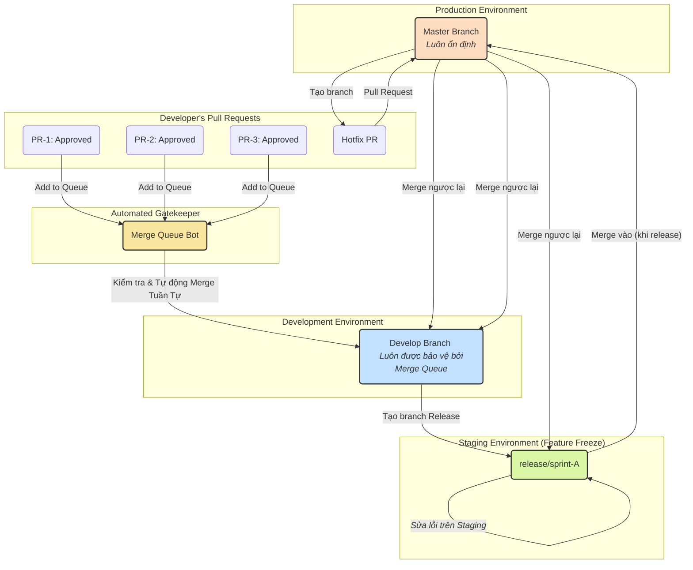
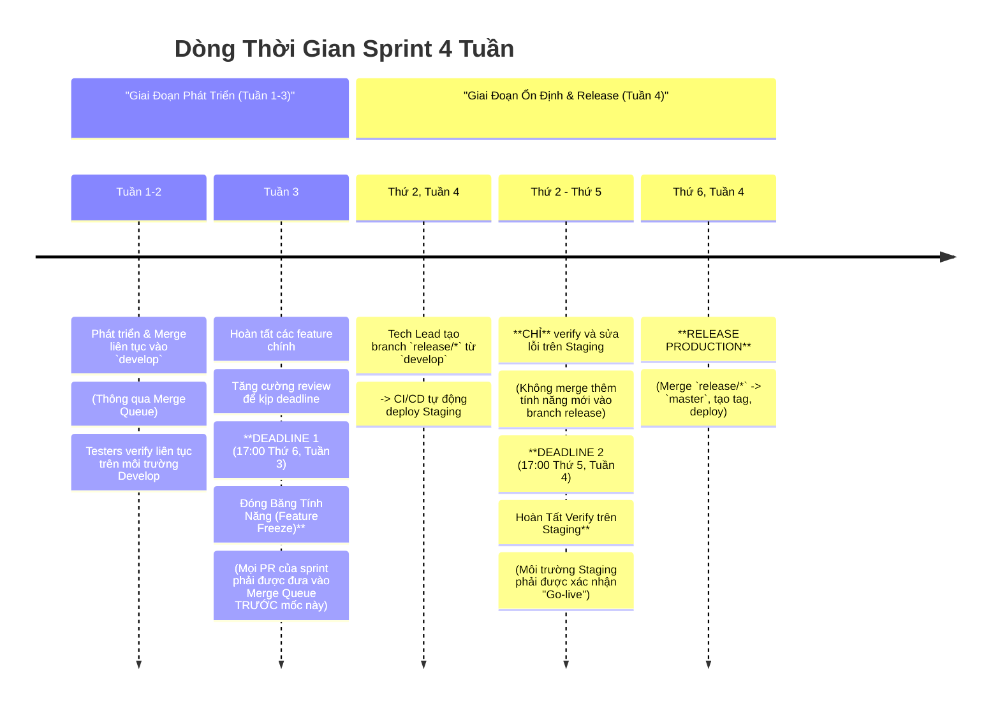

---

# **QUY TRÌNH LÀM VIỆC VỚI GIT & GITHUB**

**Phiên bản:** 2.0 | **Ngày cập nhật:** 15/09/2025

Tài liệu này mô tả quy trình làm việc chuẩn với Git, được thiết kế để giải quyết các thách thức về sự ổn định, hiệu suất và cộng tác ở quy mô lớn (nhiều team, nhiều service). Việc tuân thủ quy trình này là bắt buộc để đảm bảo chất lượng sản phẩm và hiệu suất làm việc của toàn đội ngũ.

## **Mục Lục**

1.  [Triết Lý & Mục Tiêu](#1-triết-lý--mục-tiêu)
2.  [Sơ Đồ Luồng Công Việc Tổng Quan](#2-sơ-đồ-luồng-công-việc-tổng-quan)
3.  [Mô Hình Branch](#3-mô-hình-branch)
4.  [Giải Pháp Cốt Lõi: Hàng Đợi Hợp Nhất (Merge Queue)](#4-giải-pháp-cốt-lõi-hàng-đợi-hợp-nhất-merge-queue)
5.  [Luồng Công Việc Chi Tiết](#5-luồng-công-việc-chi-tiết)
    *   [5.1. Luồng Chuẩn: Phát Triển Một Tính Năng Mới](#51-luồng-chuẩn-phát-triển-một-tính-năng-mới)
    *   [5.2. Luồng Nâng Cao: Chuẩn Bị và Release một Sprint](#52-luồng-nâng-cao-chuẩn-bị-và-release-một-sprint)
    *   [5.3. Luồng Khẩn Cấp: Sửa Lỗi Nóng trên Production (Hotfix)](#53-luồng-khẩn-cấp-sửa-lỗi-nóng-trên-production-hotfix)
6.  [Dòng Thời Gian Sprint & Các Mốc Tuân Thủ](#6-dòng-thời-gian-sprint--các-mốc-tuân-thủ)
    *   [6.1. Sơ Đồ Timeline Trực Quan (Sprint 4 Tuần)](#61-sơ-đồ-timeline-trực-quan-sprint-4-tuần)
    *   [6.2. Diễn Giải Các Giai Đoạn và Mốc Bắt Buộc](#62-diễn-giải-các-giai-đoạn-và-mốc-bắt-buộc)
7.  [Tối Ưu Hóa Hiệu Năng CI/CD](#7-tối-ưu-hóa-hiệu-năng-cicd)

---

### **1. Triết Lý & Mục Tiêu**

*   **Ổn Định Là Ưu Tiên Số 1:** Branch `develop` và `master` phải luôn ở trạng thái ổn định và sẵn sàng hoạt động.
*   **Tự Động Hóa Tối Đa:** Giảm thiểu sự can thiệp thủ công, loại bỏ các lỗi do con người và giải phóng thời gian cho developer.
*   **Hiệu Quả Ở Quy Mô Lớn:** Quy trình phải giải quyết được vấn đề tắc nghẽn khi có hàng chục Pull Request từ nhiều team được merge mỗi ngày.
*   **Minh Bạch:** Mọi người đều có thể thấy trạng thái của một thay đổi và lý do tại sao nó được hoặc chưa được hợp nhất.

---

### **2. Sơ Đồ Luồng Công Việc Tổng Quan**



---

### **3. Mô Hình Branch**

| Tên Branch | Vai Trò & Quy Tắc |
| :--- | :--- |
| **`master`** | Phản ánh code đang chạy trên **Production**. Chỉ được merge vào từ branch `release/*` hoặc `hotfix/*`. |
| **`develop`** | Branch tích hợp chính. Chứa các tính năng đã hoàn thành. **Được bảo vệ bởi Merge Queue.** |
| **`feature/*`** | Dùng để phát triển tính năng mới. Luôn tạo từ `develop`. |
| **`release/*`** | Dùng để "đóng băng" code, chuẩn bị release. Tạo từ `develop`. Được deploy lên **Staging**. |
| **`hotfix/*`** | Dùng để sửa lỗi khẩn cấp. Luôn tạo từ `master`. |

---

### **4. Giải Pháp Cốt Lõi: Hàng Đợi Hợp Nhất (Merge Queue)**

#### **a. Tại Sao Cần Merge Queue?**

Khi nhiều team cùng merge hàng chục PR vào `develop`, sẽ xảy ra "cơn bão merge" (merge storm) gây ra xung đột, tắc nghẽn CI/CD và làm hỏng môi trường `develop`. Merge Queue là một con bot "gác cổng" tự động để giải quyết vấn đề này.

#### **b. Nó Hoạt Động Như Thế Nào?**

1.  **Xếp Hàng:** Thay vì nhấn "Merge", Tech Lead nhấn **"Merge when ready" (hoặc "Add to Queue")**. PR sẽ được đưa vào một hàng đợi.
2.  **Kiểm Tra An Toàn:** Bot sẽ lấy từng PR (hoặc một nhóm PR) trong hàng đợi. Nó tạo một branch tạm chứa code của `develop` + code của PR và chạy CI/CD.
3.  **Tự Động Merge:**
    *   **Nếu CI/CD thành công:** Bot tự động merge PR vào `develop`.
    *   **Nếu CI/CD thất bại:** Bot sẽ đá PR ra khỏi hàng đợi và thông báo cho tác giả.
    *   **Kết quả:** `develop` sẽ không bao giờ bị hỏng.

#### **c. Giải Quyết Vấn Đề Hiệu Năng: Gộp Nhóm (Batching)**

Để tránh việc 10 PR phải chạy 10 pipeline nối đuôi nhau, Merge Queue sẽ **gộp nhóm** nhiều PR lại. Nó sẽ tạo một branch tạm chứa `develop` + `PR-A` + `PR-B` + `PR-C` và chạy **một pipeline duy nhất**. Nếu thành công, cả 3 PR sẽ được merge cùng lúc, giúp tiết kiệm thời gian đáng kể.

---

### **5. Luồng Công Việc Chi Tiết**

#### **5.1. Luồng Chuẩn: Phát Triển Một Tính Năng Mới**

1.  **Tạo Branch:** Luôn lấy code mới nhất từ `develop` và tạo branch `feature/*`.
    ```bash
    git checkout develop
    git pull origin develop
    git checkout -b feature/TICKET-123-ten-ngan-gon
    ```
2.  **Coding & Tạo PR:** Sau khi code xong, tạo Pull Request nhắm vào branch `develop`.
3.  **Review & Approve:** PR phải được review và có đủ số lượng approve theo quy định. Các status check (CI/CD) trên PR cũng phải thành công.
4.  **Thêm vào Hàng Đợi (Hành động mới):**
    *   Khi PR đã sẵn sàng, thay vì nút "Merge", bạn sẽ thấy nút **"Merge when ready"**.
    *   Nhấn vào nút này để đưa PR của bạn vào hàng đợi.
    *   **Công việc của bạn đã xong!** Bot Merge Queue sẽ lo phần còn lại.

#### **5.2. Luồng Nâng Cao: Chuẩn Bị và Release một Sprint**

1.  **Tạo Branch `release`:** Vào ngày "đóng băng" tính năng (xem [Timeline](#6-dòng-thời-gian-sprint--các-mốc-tuân-thủ)), Tech Lead tạo branch `release/*` từ `develop`.
    ```bash
    git checkout develop
    git pull
    git checkout -b release/sprint-19092025
    git push origin release/sprint-19092025
    ```
    *CI/CD sẽ tự động deploy branch này lên môi trường **Staging**.*

2.  **Ổn Định trên Staging:** Mọi hoạt động sửa lỗi cho sprint này sẽ diễn ra trên branch `release/*` (tạo PR nhắm vào chính branch `release/*`).

3.  **Thực Hiện Release:** Khi Staging ổn định, thực hiện merge `release/*` vào `master`, tạo tag, và deploy.
    ```bash
    # Merge vào master, tạo tag
    git checkout master && git pull
    git merge --no-ff release/sprint-19092025
    git tag -a v2.5.0 -m "Release v2.5.0"
    git push origin master --tags

    # Đồng bộ hóa ngược lại vào develop
    git checkout develop && git pull
    git merge --no-ff master
    git push origin develop
    ```
4.  **Dọn dẹp:** Xóa branch `release/*` sau khi đã merge thành công.

#### **5.3. Luồng Khẩn Cấp: Sửa Lỗi Nóng trên Production (Hotfix)**

1.  **Tạo Branch `hotfix` từ `master`:**
    ```bash
    git checkout master && git pull
    git checkout -b hotfix/TICKET-456-sua-loi-login
    ```
2.  **Sửa Lỗi & Tạo PR:** Sửa lỗi và tạo PR nhắm vào branch `master`.
3.  **Release Hotfix:** Sau khi PR được merge, **tạo tag phiên bản mới** (ví dụ: `v2.5.1`) trên `master` và deploy.
4.  **Đồng Bộ Hóa (BẮT BUỘC):** Merge `master` ngược lại vào `develop` và branch `release/*` hiện hành (nếu có) để đảm bảo lỗi được vá ở mọi nơi.

---

### **6. Dòng Thời Gian Sprint & Các Mốc Tuân Thủ**

Phần này mô tả chi tiết các giai đoạn, hoạt động và các mốc thời gian bắt buộc phải tuân thủ trong một chu kỳ Sprint.

#### **6.1. Sơ Đồ Timeline Trực Quan (Sprint 4 Tuần)**



#### **6.2. Diễn Giải Các Giai Đoạn và Mốc Bắt Buộc**

| Giai Đoạn | Thời Gian (Sprint 4 Tuần) | Hoạt Động Chính & Mốc Tuân Thủ |
| :--- | :--- | :--- |
| **1. Phát Triển Liên Tục** | **Tuần 1 → 17:00 Thứ 6, Tuần 3** | **Hoạt động:** Developers code, tạo PR nhắm vào `develop`. Khi PR được approve, thêm vào **Merge Queue**. Testers verify các ticket trên môi trường **Develop**. |
| **2. Đóng Băng Tính Năng (Feature Freeze)** | **17:00 Thứ 6, Tuần 3** | **MỐC CỨNG:** Tất cả PR của sprint **PHẢI** đã được approve và nằm trong Merge Queue. PR nào vào sau sẽ được xem xét cho sprint kế tiếp. |
| **3. Ổn Định trên Staging** | **Sáng Thứ 2, Tuần 4 → 17:00 Thứ 5, Tuần 4** | **Hoạt động:** Tech Lead tạo branch `release/*`. Môi trường **Staging** được deploy từ branch này. Testers thực hiện kiểm thử toàn diện. **CẤM** merge thêm tính năng mới vào `release/*`. |
| **4. Chốt Hạ & Release** | **17:00 Thứ 5, Tuần 4 → Sáng Thứ 6, Tuần 4** | **MỐC CỨNG:** Việc verify trên Staging phải hoàn tất và được xác nhận "Go-live". Sáng Thứ 6, team Infra/DevOps sẽ thực hiện quy trình release. |

*Lưu ý: Đối với Sprint 5 tuần, giai đoạn phát triển sẽ kéo dài 4 tuần và giai đoạn ổn định/release sẽ diễn ra ở Tuần 5.*

---

### **7. Tối Ưu Hóa Hiệu Năng CI/CD**

Để Merge Queue hoạt động hiệu quả, thời gian chạy pipeline phải nhanh. Chúng ta áp dụng chiến lược **build và test có chọn lọc**:

*   **Phát Hiện Thay Đổi:** Mỗi pipeline sẽ tự động xác định các service/module bị thay đổi bởi PR.
*   **Thực Thi Có Chọn Lọc:** Pipeline sẽ **chỉ chạy** các bước build, test, lint... cho những service bị ảnh hưởng đó. Các service không liên quan sẽ được bỏ qua.