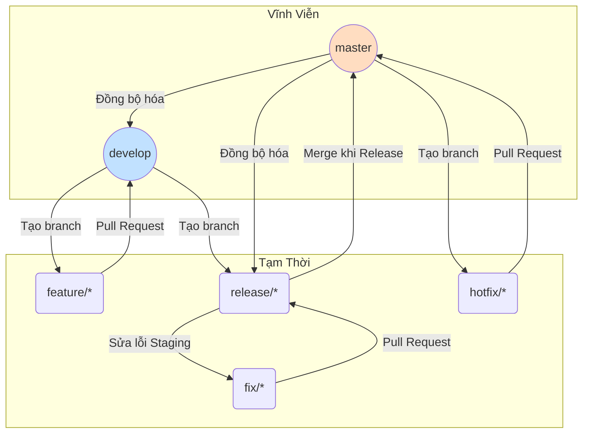
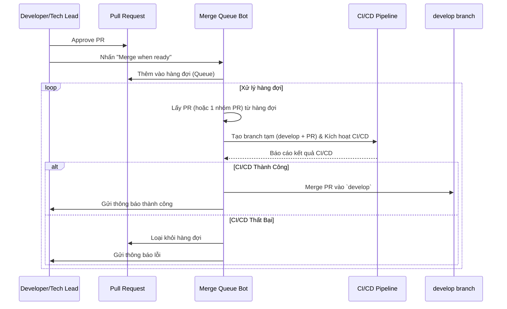
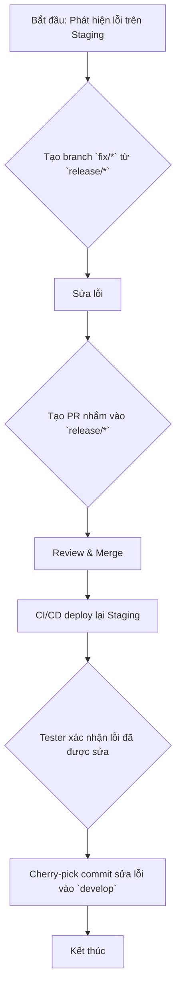
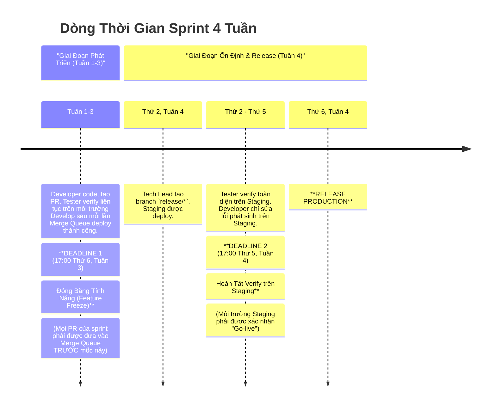

---

# **CẨM NANG GIT WORKFLOW & QUY TRÌNH RELEASE**

**Phiên bản:** 3.1 (Visual Edition) | **Ngày cập nhật:** 15/09/2025

## **Lời Mở Đầu**

Tài liệu này là nguồn tham khảo chính thức và duy nhất cho mọi hoạt động liên quan đến quản lý mã nguồn (Git) và quy trình phát hành sản phẩm. Việc tuân thủ nghiêm ngặt cẩm nang này là yếu tố tiên quyết để đảm bảo chất lượng sản phẩm, sự ổn định của hệ thống và hiệu suất cộng tác giữa các team.

## **Mục Lục**

1.  [**Phần I: Nền Tảng & Nguyên Tắc**](#phần-i-nền-tảng--nguyên-tắc)
    1.1. [Triết Lý Cốt Lõi](#11-triết-lý-cốt-lõi)
    1.2. [Tổng Quan về các Môi Trường](#12-tổng-quan-về-các-môi-trường)
    1.3. [Mô Hình Branch & Vòng Đời](#13-mô-hình-branch--vòng-đời)
2.  [**Phần II: Giải Pháp Trọng Tâm - Merge Queue**](#phần-ii-giải-pháp-trọng-tâm---merge-queue)
    2.1. [Bài Toán Cần Giải Quyết](#21-bài-toán-cần-giải-quyết)
    2.2. [Sơ Đồ Luồng Hoạt Động Của Merge Queue](#22-sơ-đồ-luồng-hoạt-động-của-merge-queue)
3.  [**Phần III: Hướng Dẫn Quy Trình Theo Từng Kịch Bản (Playbooks)**](#phần-iii-hướng-dẫn-quy-trình-theo-từng-kịch-bản-playbooks)
    3.1. [**Playbook 1: Phát Triển Một Tính Năng Mới (Luồng Chuẩn)**](#31-playbook-1-phát-triển-một-tính-năng-mới-luồng-chuẩn)
    3.2. [**Playbook 2: Chuẩn Bị và Release một Sprint**](#32-playbook-2-chuẩn-bị-và-release-một-sprint)
    3.3. [**Playbook 3: Xử Lý Lỗi Trên Môi Trường Staging**](#33-playbook-3-xử-lý-lỗi-trên-môi-trường-staging)
    3.4. [**Playbook 4: Sửa Lỗi Khẩn Cấp Trên Production (Hotfix)**](#34-playbook-4-sửa-lỗi-khẩn-cấp-trên-production-hotfix)
4.  [**Phần IV: Dòng Thời Gian & Các Mốc Tuân Thủ**](#phần-iv-dòng-thời-gian--các-mốc-tuân-thủ)
    4.1. [Sơ Đồ Timeline Trực Quan (Sprint 4 Tuần)](#41-sơ-đồ-timeline-trực-quan-sprint-4-tuần)
    4.2. [Diễn Giải Các Giai Đoạn và Trách Nhiệm](#42-diễn-giải-các-giai-đoạn-và-trách-nhiệm)
5.  [**Phần V: Tối Ưu Hóa & Quy Tắc Vàng**](#phần-v-tối-ưu-hóa--quy-tắc-vàng)
    5.1. [Tối Ưu Hóa Hiệu Năng CI/CD](#51-tối-ưu-hóa-hiệu-năng-cicd)
    5.2. [Quy Tắc Vàng Khi Làm Việc](#52-quy-tắc-vàng-khi-làm-việc)

---

## **Phần I: Nền Tảng & Nguyên Tắc**

### **1.1. Triết Lý Cốt Lõi**

*   **Ổn Định Là Tối Thượng:** `master` và `develop` phải luôn ở trạng thái có thể hoạt động.
*   **Tự Động Hóa Là Chìa Khóa:** Giảm thiểu can thiệp thủ công để loại bỏ lỗi và tăng tốc độ.
*   **Chất Lượng Là Trách Nhiệm Chung:** Developer chịu trách nhiệm về chất lượng code của mình trước khi merge. Tester chịu trách nhiệm xác thực chất lượng trên các môi trường tích hợp.
*   **Minh Bạch & Dễ Đoán:** Quy trình phải rõ ràng, giúp mọi người biết điều gì đang xảy ra và điều gì sắp xảy ra.

### **1.2. Tổng Quan về các Môi Trường**

| Môi Trường | Branch GitHub Tương Ứng | Mục Đích |
| :--- | :--- | :--- |
| **Local** | `feature/*`, `fix/*`, `hotfix/*` | Môi trường phát triển cá nhân trên máy của Developer. |
| **Develop** | `develop` | Môi trường tích hợp liên tục. Chứa các tính năng mới nhất đã qua vòng review code đầu tiên. Dành cho Tester verify tính năng và kiểm thử tích hợp sớm. |
| **Staging** | `release/*` | Môi trường giả lập Production. Dùng để "đóng băng" phiên bản, kiểm thử hồi quy toàn diện và UAT trước khi release. |
| **Production** | `master` | Môi trường thật, phục vụ người dùng cuối. |

### **1.3. Mô Hình Branch & Vòng Đời**

Sơ đồ dưới đây minh họa mối quan hệ và luồng di chuyển code giữa các loại branch chính.



| Tên Branch | Vòng Đời | Nguồn Tạo | Đích Merge | Vai Trò |
| :--- | :--- | :--- | :--- | :--- |
| **`master`** | Vĩnh viễn | - | - | Phản ánh code **Production**. |
| **`develop`** | Vĩnh viễn | - | - | Branch tích hợp chính, được bảo vệ bởi **Merge Queue**. |
| **`feature/*`** | Tạm thời | `develop` | `develop` | Phát triển tính năng mới. |
| **`release/*`** | Tạm thời | `develop` | `master` | Chuẩn bị release, deploy lên **Staging**. |
| **`fix/*`** | Tạm thời | `release/*` | `release/*` | Sửa lỗi phát hiện trên **Staging**. |
| **`hotfix/*`** | Tạm thời | `master` | `master` | Sửa lỗi khẩn cấp trên **Production**. |

---

## **Phần II: Giải Pháp Trọng Tâm - Merge Queue**

### **2.1. Bài Toán Cần Giải Quyết**

Khi nhiều team cùng merge hàng chục PR vào `develop`, sẽ xảy ra "cơn bão merge" (merge storm) gây ra xung đột, tắc nghẽn CI/CD và làm hỏng môi trường `develop`, chặn đứng công việc của toàn bộ team.

### **2.2. Sơ Đồ Luồng Hoạt Động Của Merge Queue**

Đây là cách bot "gác cổng" xử lý các PR một cách an toàn và tự động.



---

## **Phần III: Hướng Dẫn Quy Trình Theo Từng Kịch Bản (Playbooks)**

### **3.1. Playbook 1: Phát Triển Một Tính Năng Mới (Luồng Chuẩn)**

**Mục tiêu:** Đưa code của một ticket từ máy local lên môi trường `develop`.

```mermaid
graph TD
    A[Bắt đầu: Lấy code mới nhất từ `develop`] --> B{Tạo branch `feature/*`};
    B --> C[Code & Tự kiểm thử trên Local];
    C --> D{Tạo Pull Request nhắm vào `develop`};
    D --> E[Review Code & Approve];
    E --> F(Nhấn "Merge when ready");
    F --> G((Merge Queue tự động xử lý));
    G --> H[Tester verify trên môi trường Develop];
    H --> I[Kết thúc];
```

### **3.2. Playbook 2: Chuẩn Bị và Release một Sprint**

**Mục tiêu:** Chốt phạm vi, ổn định và phát hành phiên bản mới.

```mermaid
graph TD
    A[Bắt đầu: Đến hạn Feature Freeze] --> B{Tạo branch `release/*` từ `develop`};
    B --> C[CI/CD tự động deploy lên Staging];
    C --> D{Tester verify & báo cáo lỗi trên Staging};
    D -- Lỗi phát sinh --> E[Thực hiện Playbook 3: Sửa lỗi Staging];
    E --> D;
    D -- Mọi thứ ổn định --> F[Xác nhận "Go-live"];
    F --> G{Merge `release/*` vào `master`};
    G --> H[Tạo Tag phiên bản mới];
    H --> I[Deploy Production];
    I --> J{Đồng bộ hóa `master` ngược lại vào `develop`};
    J --> K[Xóa branch `release/*`];
    K --> L[Kết thúc];
```

### **3.3. Playbook 3: Xử Lý Lỗi Trên Môi Trường Staging**

**Mục tiêu:** Vá lỗi trên phiên bản sắp release một cách nhanh chóng và an toàn.



### **3.4. Playbook 4: Sửa Lỗi Khẩn Cấp Trên Production (Hotfix)**

**Mục tiêu:** Đưa một bản vá lỗi nghiêm trọng lên Production trong thời gian ngắn nhất.

```mermaid
graph TD
    A[Bắt đầu: Lỗi nghiêm trọng trên Production] --> B{Tạo branch `hotfix/*` từ `master`};
    B --> C[Sửa lỗi];
    C --> D{Tạo PR nhắm vào `master`};
    D --> E[Deploy branch `hotfix/*` tạm thời lên Staging để verify];
    E --> F{Tester xác nhận hotfix hoạt động tốt};
    F --> G[Merge PR vào `master`];
    G --> H[Tạo Tag phiên bản mới];
    H --> I[Deploy Production];
    I --> J{Đồng bộ hóa `master` vào `develop` VÀ `release/*` (nếu có)};
    J --> K[Kết thúc];
```

---

## **Phần IV: Dòng Thời Gian & Các Mốc Tuân Thủ**

### **4.1. Sơ Đồ Timeline Trực Quan (Sprint 4 Tuần)**



### **4.2. Diễn Giải Các Giai Đoạn và Trách Nhiệm**

| Giai Đoạn | Thời Gian (Sprint 4 Tuần) | Trách Nhiệm Chính |
| :--- | :--- | :--- |
| **1. Phát Triển Liên Tục** | **Tuần 1 → 17:00 Thứ 6, Tuần 3** | **Dev:** Hoàn thành các ticket và đưa vào Merge Queue. **Tester:** Verify các ticket đã được deploy trên môi trường `develop`. |
| **2. Đóng Băng Tính Năng** | **17:00 Thứ 6, Tuần 3** | **Tech Lead/PM:** Đảm bảo phạm vi sprint đã được chốt và tất cả PR liên quan đã vào hàng đợi. |
| **3. Ổn Định trên Staging** | **Sáng Thứ 2, Tuần 4 → 17:00 Thứ 5, Tuần 4** | **Tester:** Thực hiện kiểm thử hồi quy và UAT. **Dev:** Sẵn sàng sửa các lỗi được báo cáo từ Staging. |
| **4. Chốt Hạ & Release** | **17:00 Thứ 5, Tuần 4 → Sáng Thứ 6, Tuần 4** | **Tester/PM:** Xác nhận "Go-live". **Infra/DevOps:** Thực hiện quy trình deploy Production. |

*Lưu ý: Đối với Sprint 5 tuần, giai đoạn phát triển sẽ kéo dài 4 tuần và giai đoạn ổn định/release sẽ diễn ra ở Tuần 5.*

---

## **Phần V: Tối Ưu Hóa & Quy Tắc Vàng**

### **5.1. Tối Ưu Hóa Hiệu Năng CI/CD**

Để Merge Queue hoạt động hiệu quả, pipeline phải nhanh. Chúng ta áp dụng chiến lược **build và test có chọn lọc**: pipeline sẽ tự động xác định các service bị thay đổi bởi PR và **chỉ chạy** các bước build/test cho những service bị ảnh hưởng đó.

### **5.2. Quy Tắc Vàng Khi Làm Việc**

*   **Luôn `pull` trước khi tạo branch mới.**
*   **Commit thường xuyên với message ý nghĩa.**
*   **Không bao giờ push trực tiếp lên `develop` và `master`.**
*   **PR phải có mô tả rõ ràng, link đến ticket và hướng dẫn verify.**
*   **Chủ động theo dõi PR của mình** và xử lý các comment từ reviewer.
*   **Luôn dọn dẹp branch** sau khi đã được merge thành công.
*   **Giao tiếp là trên hết.** Khi có tình huống khẩn cấp hoặc không chắc chắn, hãy thông báo và trao đổi với team.