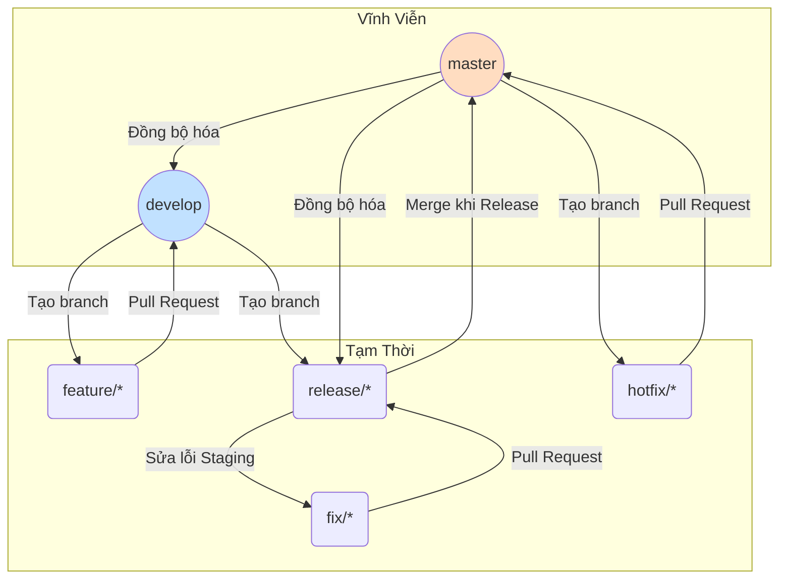
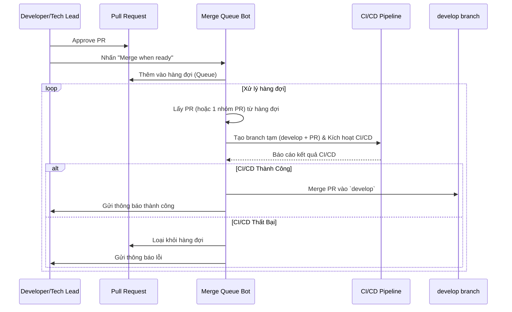
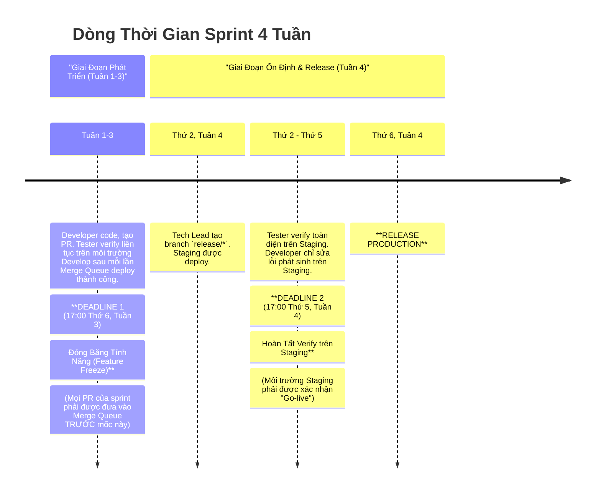

---

# **CẨM NANG GIT WORKFLOW & QUY TRÌNH RELEASE**

**Phiên bản:** 3.1 (Visual Edition) | **Ngày cập nhật:** 15/09/2025

## **Lời Mở Đầu**

Tài liệu này là nguồn tham khảo chính thức và duy nhất cho mọi hoạt động liên quan đến quản lý mã nguồn (Git) và quy trình phát hành sản phẩm. Việc tuân thủ nghiêm ngặt cẩm nang này là yếu tố tiên quyết để đảm bảo chất lượng sản phẩm, sự ổn định của hệ thống và hiệu suất cộng tác giữa các team.

## **Mục Lục**

1.  [**Phần I: Nền Tảng & Nguyên Tắc**](#phần-i-nền-tảng--nguyên-tắc)  
    &nbsp;&nbsp;&nbsp;&nbsp;1.1. [Triết Lý Cốt Lõi](#11-triết-lý-cốt-lõi)  
    &nbsp;&nbsp;&nbsp;&nbsp;1.2. [Tổng Quan về các Môi Trường](#12-tổng-quan-về-các-môi-trường)  
    &nbsp;&nbsp;&nbsp;&nbsp;1.3. [Mô Hình Branch & Vòng Đời](#13-mô-hình-branch--vòng-đời)  
2.  [**Phần II: Giải Pháp Trọng Tâm - Merge Queue**](#phần-ii-giải-pháp-trọng-tâm---merge-queue)  
    &nbsp;&nbsp;&nbsp;&nbsp;2.1. [Bài Toán Cần Giải Quyết](#21-bài-toán-cần-giải-quyết)  
    &nbsp;&nbsp;&nbsp;&nbsp;2.2. [Sơ Đồ Luồng Hoạt Động Của Merge Queue](#22-sơ-đồ-luồng-hoạt-động-của-merge-queue)  
3.  [**Phần III: Hướng Dẫn Quy Trình Theo Từng Kịch Bản (Playbooks)**](#phần-iii-hướng-dẫn-quy-trình-theo-từng-kịch-bản-playbooks)  
    &nbsp;&nbsp;&nbsp;&nbsp;3.1. [**Playbook 1: Phát Triển Một Tính Năng Mới (Luồng Chuẩn)**](#31-playbook-1-phát-triển-một-tính-năng-mới-luồng-chuẩn)  
    &nbsp;&nbsp;&nbsp;&nbsp;3.2. [**Playbook 2: Chuẩn Bị và Release một Sprint**](#32-playbook-2-chuẩn-bị-và-release-một-sprint)  
    &nbsp;&nbsp;&nbsp;&nbsp;3.3. [**Playbook 3: Xử Lý Lỗi Trên Môi Trường Staging**](#33-playbook-3-xử-lý-lỗi-trên-môi-trường-staging)  
    &nbsp;&nbsp;&nbsp;&nbsp;3.4. [**Playbook 4: Sửa Lỗi Khẩn Cấp Trên Production (Hotfix)**](#34-playbook-4-sửa-lỗi-khẩn-cấp-trên-production-hotfix)  
4.  [**Phần IV: Dòng Thời Gian & Các Mốc Tuân Thủ**](#phần-iv-dòng-thời-gian--các-mốc-tuân-thủ)  
    &nbsp;&nbsp;&nbsp;&nbsp;4.1. [Sơ Đồ Timeline Trực Quan (Sprint 4 Tuần)](#41-sơ-đồ-timeline-trực-quan-sprint-4-tuần)  
    &nbsp;&nbsp;&nbsp;&nbsp;4.2. [Diễn Giải Các Giai Đoạn và Trách Nhiệm](#42-diễn-giải-các-giai-đoạn-và-trách-nhiệm)  
5.  [**Phần V: Tối Ưu Hóa & Quy Tắc Vàng**](#phần-v-tối-ưu-hóa--quy-tắc-vàng)  
    &nbsp;&nbsp;&nbsp;&nbsp;5.1. [Tối Ưu Hóa Hiệu Năng CI/CD](#51-tối-ưu-hóa-hiệu-năng-cicd)  
    &nbsp;&nbsp;&nbsp;&nbsp;5.2. [Quy Tắc Vàng Khi Làm Việc](#52-quy-tắc-vàng-khi-làm-việc)  

---

## **Phần I: Nền Tảng & Nguyên Tắc**

### **1.1. Triết Lý Cốt Lõi**

*   **Ổn Định Là Tối Thượng:** `master` và `develop` phải luôn ở trạng thái có thể hoạt động.
*   **Tự Động Hóa Là Chìa Khóa:** Giảm thiểu can thiệp thủ công để loại bỏ lỗi và tăng tốc độ.
*   **Chất Lượng Là Trách Nhiệm Chung:** Developer chịu trách nhiệm về chất lượng code của mình trước khi merge. Tester chịu trách nhiệm xác thực chất lượng trên các môi trường tích hợp.
*   **Minh Bạch & Dễ Đoán:** Quy trình phải rõ ràng, giúp mọi người biết điều gì đang xảy ra và điều gì sắp xảy ra.

### **1.2. Tổng Quan về các Môi Trường**

| Môi Trường | Branch GitHub Tương Ứng | Mục Đích |
| :--- | :--- | :--- |
| **Local** | `feature/*`, `fix/*`, `hotfix/*` | Môi trường phát triển cá nhân trên máy của Developer. |
| **Develop** | `develop` | Môi trường tích hợp liên tục. Chứa các tính năng mới nhất đã qua vòng review code đầu tiên. Dành cho Tester verify tính năng và kiểm thử tích hợp sớm. |
| **Staging** | `release/*` | Môi trường giả lập Production. Dùng để "đóng băng" phiên bản, kiểm thử hồi quy toàn diện và UAT trước khi release. |
| **Production** | `master` | Môi trường thật, phục vụ người dùng cuối. |

### **1.3. Mô Hình Branch & Vòng Đời**

Sơ đồ dưới đây minh họa mối quan hệ và luồng di chuyển code giữa các loại branch chính.

| Tên Branch | Vòng Đời | Nguồn Tạo | Đích Merge | Vai Trò |
| :--- | :--- | :--- | :--- | :--- |
| **`master`** | Vĩnh viễn | - | - | Phản ánh code **Production**. |
| **`develop`** | Vĩnh viễn | - | - | Branch tích hợp chính, được bảo vệ bởi **Merge Queue**. |
| **`feature/*`** | Tạm thời | `develop` | `develop` | Phát triển tính năng mới. |
| **`release/*`** | Tạm thời | `develop` | `master` | Chuẩn bị release, deploy lên **Staging**. |
| **`fix/*`** | Tạm thời | `release/*` | `release/*` | Sửa lỗi phát hiện trên **Staging**. |
| **`hotfix/*`** | Tạm thời | `master` | `master` | Sửa lỗi khẩn cấp trên **Production**. |

---

## **Phần II: Giải Pháp Trọng Tâm - Merge Queue**

### **2.1. Bài Toán Cần Giải Quyết**

Khi nhiều team cùng merge hàng chục PR vào `develop`, sẽ xảy ra "cơn bão merge" (merge storm) gây ra xung đột, tắc nghẽn CI/CD và làm hỏng môi trường `develop`, chặn đứng công việc của toàn bộ team.

### **2.2. Sơ Đồ Luồng Hoạt Động Của Merge Queue**

Đây là cách bot "gác cổng" xử lý các PR một cách an toàn và tự động.

---
### **Phần III: Hướng Dẫn Quy Trình Theo Từng Kịch Bản (Playbooks)**

Đây là hướng dẫn chi tiết, từng bước cho các tình huống công việc hàng ngày. Mỗi playbook được thiết kế như một danh sách kiểm tra (checklist) để đảm bảo không bỏ sót bất kỳ bước quan trọng nào.

---

### **3.1. Playbook 1: Phát Triển Một Tính Năng Mới (Luồng Chuẩn)**

**🎯 Mục tiêu:** Đưa code của một ticket từ máy local của developer lên môi trường `develop` một cách an toàn. Đây là luồng công việc diễn ra hàng ngày.

| Bước | Ai thực hiện? | Hành động cụ thể & Hướng dẫn | Mục đích / Lưu ý quan trọng |
| :--- | :--- | :--- | :--- |
| **1. Chuẩn bị** | 👨‍💻 **Developer** | 1. Lấy code mới nhất từ `develop`:  `git checkout develop` `git pull origin develop` 2. Tạo branch mới theo quy tắc đặt tên: `git checkout -b feature/TICKET-123-ten-ngan-gon` | Đảm bảo bạn bắt đầu từ nền tảng code mới nhất để tránh conflict về sau. |
| **2. Phát triển & Tự kiểm thử** | 👨‍💻 **Developer** | 1. Thực hiện coding cho ticket. 2. **Tự chạy và kiểm thử kỹ lưỡng trên môi trường local.** 3. Viết/Cập nhật các bài Unit Test & Integration Test cần thiết. | **Chất lượng bắt đầu từ chính developer.** Đảm bảo tính năng hoạt động đúng trước khi nhờ người khác review. |
| **3. Tạo Pull Request** | 👨‍💻 **Developer** | 1. Push branch `feature/*` lên GitHub. 2. Tạo Pull Request (PR) với đích là branch **`develop`**. 3. **Viết mô tả PR đầy đủ:** Link ticket, tóm tắt thay đổi, hướng dẫn cho Tester. | Cung cấp đủ thông tin sẽ giúp quá trình review nhanh hơn và Tester biết cách kiểm tra tính năng của bạn. |
| **4. Review & Approve** | 👀 **Reviewer / Tech Lead** | 1. Review code dựa trên các tiêu chuẩn về logic, hiệu năng, và coding convention. 2. Yêu cầu chỉnh sửa nếu cần. 3. Nhấn **"Approve"** khi PR đã đạt chất lượng. | Đảm bảo chất lượng code và là bước kiểm soát chéo quan trọng. |
| **5. Thêm vào Hàng đợi** | 👨‍💻 **Developer / Tech Lead** | 1. Sau khi PR được approve và các status check (CI/CD) đã pass. 2. Nhấn vào nút **"Merge when ready"**.  🚨 **TUYỆT ĐỐI KHÔNG** dùng "Rebase and merge" hay "Squash and merge" trực tiếp. | **Đây là bước chuyển giao trách nhiệm.** Bạn đã hoàn thành công việc của mình và bàn giao việc hợp nhất code cho Bot Merge Queue. |
| **6. Verify trên Develop** | 🧪 **Tester** | 1. Nhận thông báo khi một "chuyến tàu" PR được deploy thành công lên môi trường `develop`. 2. Vào môi trường `develop` để kiểm tra và xác nhận chức năng của ticket tương ứng. | Xác nhận rằng tính năng hoạt động đúng trong môi trường tích hợp chung với code của các thành viên khác. |

---

### **3.2. Playbook 2: Chuẩn Bị và Release một Sprint**

**🎯 Mục tiêu:** Chốt phạm vi của sprint, ổn định hệ thống trên Staging và phát hành phiên bản mới lên Production một cách có kiểm soát.

| Bước | Ai thực hiện? | Hành động cụ thể & Hướng dẫn | Mục đích / Lưu ý quan trọng |
| :--- | :--- | :--- | :--- |
| **1. Đóng băng Tính năng** | 👑 **Tech Lead / PM** | 1. Tuân thủ **DEADLINE 1** (ví dụ: 17:00 Thứ 6, Tuần 3). 2. Tạo branch `release/*` từ `develop`: `git checkout develop && git pull` `git checkout -b release/sprint-19092025` `git push origin release/sprint-19092025` | **Chốt phạm vi công việc.** Ngăn chặn các tính năng mới được thêm vào phút chót, gây rủi ro cho phiên bản release. |
| **2. Triển khai Staging** | 🤖 **CI/CD** | Hệ thống sẽ tự động nhận diện branch `release/*` mới và deploy nó lên môi trường **Staging**. | Tự động hóa quá trình chuẩn bị môi trường kiểm thử cuối cùng. |
| **3. Ổn định trên Staging** | 🧪 **Tester** & 👨‍💻 **Developer** | 1. **Tester:** Thực hiện kiểm thử hồi quy toàn diện, UAT trên Staging. 2. **Developer:** Sẵn sàng nhận và sửa các lỗi được báo cáo từ Staging bằng cách thực hiện **Playbook 3**. | Đây là giai đoạn "tổng duyệt" cuối cùng. Mục tiêu là tìm và diệt tất cả các bug nghiêm trọng trước khi ra mắt. |
| **4. Xác nhận "Go-live"** | 🧪 **Tester / PM** | Tuân thủ **DEADLINE 2** (ví dụ: 17:00 Thứ 5, Tuần 4). Chính thức xác nhận phiên bản trên Staging đã đủ điều kiện để phát hành. | Là quyết định kinh doanh và kỹ thuật quan trọng, xác nhận sản phẩm đã sẵn sàng. |
| **5. Thực hiện Release** | ⚙️ **Infra/DevOps / Tech Lead** | 1. Merge branch `release/*` vào `master`. 2. **Tạo Tag phiên bản mới** trên `master`: `git tag -a v2.5.0 -m "Release v2.5.0"` `git push origin v2.5.0` 3. Deploy `master` lên **Production**. | Quy trình phát hành chính thức. Việc tạo Tag là bắt buộc để có thể rollback khi cần. |
| **6. Đồng bộ hóa & Dọn dẹp** | 👑 **Tech Lead** | 1. Merge `master` ngược lại vào `develop` để cập nhật các bản vá lỗi cuối cùng. 2. Xóa branch `release/*` đã hoàn thành nhiệm vụ trên GitHub. | Giữ cho `develop` luôn là phiên bản mới nhất và repository gọn gàng. |

---

### **3.3. Playbook 3: Xử Lý Lỗi Trên Môi Trường Staging**

**🎯 Mục tiêu:** Vá lỗi được phát hiện trên phiên bản sắp release một cách nhanh chóng, an toàn và không ảnh hưởng đến `develop`.

| Bước | Ai thực hiện? | Hành động cụ thể & Hướng dẫn | Mục đích / Lưu ý quan trọng |
| :--- | :--- | :--- | :--- |
| **1. Tạo Branch Sửa Lỗi** | 👨‍💻 **Developer** | 1. Lấy code mới nhất từ branch `release/*` hiện tại. 2. Tạo branch `fix/*` từ đó: `git checkout release/sprint-19092025 && git pull` `git checkout -b fix/TICKET-789-bug-tren-staging` | **Sửa lỗi tại nguồn.** Branch `fix` phải bắt nguồn từ `release` để đảm bảo chỉ vá lỗi trên phiên bản đang được kiểm thử. |
| **2. Sửa lỗi & Tạo PR** | 👨‍💻 **Developer** | 1. Sửa lỗi trên branch `fix/*`. 2. Tạo PR với đích là branch **`release/sprint-19092025`**. | Cô lập hoàn toàn việc sửa lỗi, không dính dáng gì đến các tính năng mới trên `develop`. |
| **3. Merge & Deploy lại Staging** | 👑 **Tech Lead** & 🤖 **CI/CD** | 1. Review và merge PR sửa lỗi vào `release/*`. 2. CI/CD sẽ tự động deploy lại phiên bản đã vá lỗi lên **Staging**. | Cập nhật nhanh chóng bản vá lên môi trường Staging để Tester có thể xác nhận. |
| **4. Xác nhận đã sửa lỗi** | 🧪 **Tester** | Vào lại môi trường Staging để kiểm tra và xác nhận bug đã được khắc phục. | Đảm bảo chất lượng của phiên bản release. |
| **5. Đồng bộ hóa với `develop`** | 👨‍💻 **Developer / Tech Lead** | 1. Lấy mã hash của commit sửa lỗi trên `release/*`. 2. Dùng `cherry-pick` để áp dụng commit đó vào `develop`: `git checkout develop && git pull` `git cherry-pick <commit_hash>` `git push` | **BẮT BUỘC.** Tránh cho lỗi này bị tái phát ở sprint sau. |

---

### **3.4. Playbook 4: Sửa Lỗi Khẩn Cấp Trên Production (Hotfix)**

**🎯 Mục tiêu:** Đưa một bản vá lỗi nghiêm trọng lên Production trong thời gian ngắn nhất với **chất lượng được đảm bảo**.

| Bước | Ai thực hiện? | Hành động cụ thể & Hướng dẫn | Mục đích / Lưu ý quan trọng |
| :--- | :--- | :--- | :--- |
| **1. Giao tiếp** | 👑 **Tech Lead / PM** | **Thông báo khẩn** cho toàn team: *"Môi trường Staging sẽ được sử dụng để verify hotfix trong [X] giờ. Mọi hoạt động verify sprint trên Staging tạm dừng."* | Minh bạch và tránh gây gián đoạn cho các thành viên khác. |
| **2. Tạo Branch Hotfix** | 👨‍💻 **Developer** | 1. Lấy code mới nhất từ **`master`**. 2. Tạo branch `hotfix/*` từ đó: `git checkout master && git pull` `git checkout -b hotfix/TICKET-999-sua-loi-thanh-toan` | **An toàn tuyệt đối.** `master` là nguồn duy nhất phản ánh chính xác code đang chạy trên Production. |
| **3. Sửa lỗi & Tạo PR** | 👨‍💻 **Developer** | 1. Sửa lỗi trên branch `hotfix/*`. 2. Tạo PR với đích là branch **`master`**. Yêu cầu ít nhất 2 reviewer. | Luồng đi thẳng tới Production, bỏ qua `develop`. Yêu cầu review chéo để tăng chất lượng. |
| **4. Deploy & Verify trên Staging** | ⚙️ **Infra/DevOps** & 🧪 **Tester** | 1. **Infra/DevOps:** Tạm thời deploy branch `hotfix/*` lên môi trường **Staging**. 2. **Tester:** Thực hiện kiểm thử khẩn cấp trên Staging với phạm vi:    - **Cấp 1: Xác minh bản vá:** Lỗi gốc đã được sửa chưa?    - **Cấp 2: Hồi quy phạm vi hẹp:** Các tính năng liên quan có bị ảnh hưởng không?    - **Cấp 3: Sanity check:** Hệ thống có hoạt động bình thường không? | **BƯỚC KIỂM SOÁT CHẤT LƯỢNG BẮT BUỘC.** Đảm bảo bản vá giải quyết được vấn đề mà không tạo ra vấn đề mới. |
| **5. Xác nhận "Go-live"** | 🧪 **Tester** & 👑 **Tech Lead** | Chỉ khi Tester xác nhận **"Test Pass"** trên Staging, Tech Lead mới được phép tiến hành bước tiếp theo. | Quyết định cuối cùng dựa trên kết quả kiểm thử thực tế. |
| **6. Release Hotfix** | ⚙️ **Infra/DevOps** & 👑 **Tech Lead** | 1. Merge PR hotfix vào `master`. 2. **Tạo Tag phiên bản vá lỗi mới** (ví dụ: `v2.5.1`). 3. Deploy `master` lên **Production**. | Hoàn tất quá trình phát hành bản vá. Theo dõi chặt chẽ hệ thống sau khi deploy. |
| **7. Đồng bộ hóa Toàn Diện** | 👑 **Tech Lead** | 1. Merge `master` (đã chứa hotfix) ngược lại vào:  - Branch **`develop`**.  - Branch **`release/*`** hiện hành (nếu có). 2. Khôi phục lại Staging về branch `release/*` và thông báo cho team. | **CỰC KỲ QUAN TRỌNG.** Đảm bảo lỗi được vá ở tất cả các dòng code chính, tránh nợ kỹ thuật. |

---

## **Phần IV: Dòng Thời Gian & Các Mốc Tuân Thủ**

### **4.1. Sơ Đồ Timeline Trực Quan (Sprint 4 Tuần)**

### **4.2. Diễn Giải Các Giai Đoạn và Trách Nhiệm**

| Giai Đoạn | Thời Gian (Sprint 4 Tuần) | Trách Nhiệm Chính |
| :--- | :--- | :--- |
| **1. Phát Triển Liên Tục** | **Tuần 1 → 17:00 Thứ 6, Tuần 3** | **Dev:** Hoàn thành các ticket và đưa vào Merge Queue. **Tester:** Verify các ticket đã được deploy trên môi trường `develop`. |
| **2. Đóng Băng Tính Năng** | **17:00 Thứ 6, Tuần 3** | **Tech Lead/PM:** Đảm bảo phạm vi sprint đã được chốt và tất cả PR liên quan đã vào hàng đợi. |
| **3. Ổn Định trên Staging** | **Sáng Thứ 2, Tuần 4 → 17:00 Thứ 5, Tuần 4** | **Tester:** Thực hiện kiểm thử hồi quy và UAT. **Dev:** Sẵn sàng sửa các lỗi được báo cáo từ Staging. |
| **4. Chốt Hạ & Release** | **17:00 Thứ 5, Tuần 4 → Sáng Thứ 6, Tuần 4** | **Tester/PM:** Xác nhận "Go-live". **Infra/DevOps:** Thực hiện quy trình deploy Production. |

*Lưu ý: Đối với Sprint 5 tuần, giai đoạn phát triển sẽ kéo dài 4 tuần và giai đoạn ổn định/release sẽ diễn ra ở Tuần 5.*

---

## **Phần V: Tối Ưu Hóa & Quy Tắc Vàng**

### **5.1. Tối Ưu Hóa Hiệu Năng CI/CD**

Để Merge Queue hoạt động hiệu quả, pipeline phải nhanh. Chúng ta áp dụng chiến lược **build và test có chọn lọc**: pipeline sẽ tự động xác định các service bị thay đổi bởi PR và **chỉ chạy** các bước build/test cho những service bị ảnh hưởng đó.

### **5.2. Quy Tắc Vàng Khi Làm Việc**

*   **Luôn `pull` trước khi tạo branch mới.**
*   **Commit thường xuyên với message ý nghĩa.**
*   **Không bao giờ push trực tiếp lên `develop` và `master`.**
*   **PR phải có mô tả rõ ràng, link đến ticket và hướng dẫn verify.**
*   **Chủ động theo dõi PR của mình** và xử lý các comment từ reviewer.
*   **Luôn dọn dẹp branch** sau khi đã được merge thành công.
*   **Giao tiếp là trên hết.** Khi có tình huống khẩn cấp hoặc không chắc chắn, hãy thông báo và trao đổi với team.